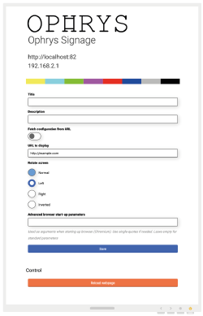
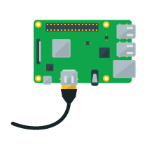

Ophrys Signage
=========================================================

* Web Site: https://www.irisbroadcast.org
* Github: https://github.com/IrisBroadcast/OphrysSignage

A simple way to display a webpage on a screen without all the fuzz.
Basic signage solution with configuration page for url selection,
screen rotation and option to fetch configuration settings from
external server. We are using it with Linux Debian Buster on
Raspberry Pi 3 and 4. This should work fine on other hardwares
as well. Let us know if you run into any problems or have any questions.

We use it to display system monitoring and door-signage for our broadcast studios.

#### Components
- Whiptail install script (Guides the installation of dependencies)
- Debian + OpenBox + LightDM + Xserver
- Chromium Browser + OMXPlayer
- NodeJs server for configuration
- Bash scripts for setting URLs and screen rotation

#### Features
- Fullscreen browser without window decorations
- Loading image on boot (Ophrys graphics)
- Rotate screen on both Raspberry Pi 3 and 4 without reboot
- Load a configuration JSON from an external site with settings
- REST API for page refresh and */health* endpoint for status information
- Built in multi webpage iframe view, with transitioning abilities
- Built in webpage with a studio-clock
- Automatic and regular security updates (default: once a week)
- Local firewall included in installation (add your custom rules in the configuration file)




License
=======

Ophrys Signage is Copyright (c) 2019 Roger Sandholm & Jim Eld, Stockholm, Sweden
The code is licensed under the BSD 3-clause license.

The license for Ophrys Signage is in the LICENSE.txt file


## How to get started (Using a Raspberry Pi)

First go to [Raspbian Buster Download](https://www.raspberrypi.org/downloads/) and download Raspbian Buster Lite or Raspian Buster Desktop - we normally use Buster Lite

Burn the image on an SD-card. We use “Balena Etcher” to get the image on to the SD-card (https://www.balena.io/etcher/)

Depending on your way of installing and later setup, decide between:
- Connecting a mouse and keyboard and write all the commands and follow instruction in the terminal on screen.
- Connect via SSH and write all the commands and follow instruction in the terminal on screen.

If SSH is used, remember to add an empty file to the **/boot/** folder named “SSH” without file end, this is done after the image has been written to your SD card.
This empty file in boot folder enables SSH on Debian with the default username “pi” and password “raspberry” on boot.

======================

Now it's time to download the installation tool from us to the unit, a terminal command is used to get the tool/script.

Boot up the device, open a terminal window (through SSH or with a keyboard and display) and run:
   ```sh
   wget -O /tmp/install.tar.gz https://irisbroadcast.com/ophrys/install.tar.gz && tar -C /tmp -xvzf /tmp/install.tar.gz && sudo bash /tmp/ophrys-install.sh

   ```
   Or if you're behind a corporate proxy, use the following command instead:
   ```sh
   wget -O /tmp/install.tar.gz https://irisbroadcast.com/ophrys/install.tar.gz -e use_proxy=yes -e https_proxy=user:password@proxy.com && tar -C /tmp -xvzf /tmp/install.tar.gz && sudo bash /tmp/ophrys-install.sh
   ```


The script will fetch an installation tool and start it up automatically. To continue setup follow the on-screen instructions.


### Advanced
If you want to follow along with the installation, in more detail than the whiptail interface. Open a new terminal window and type this command to follow the installation process.
```sh
tail -f /var/log/ophrys-full-install.log
```

When the applications and scripts are running they log to the following file:
```sh
tail -f /var/log/aloe/main.log
```

## Responsible Maintainers
- [Jim Eld](https://github.com/djhenley)
- [Roger Sandholm](https://github.com/Roog)
